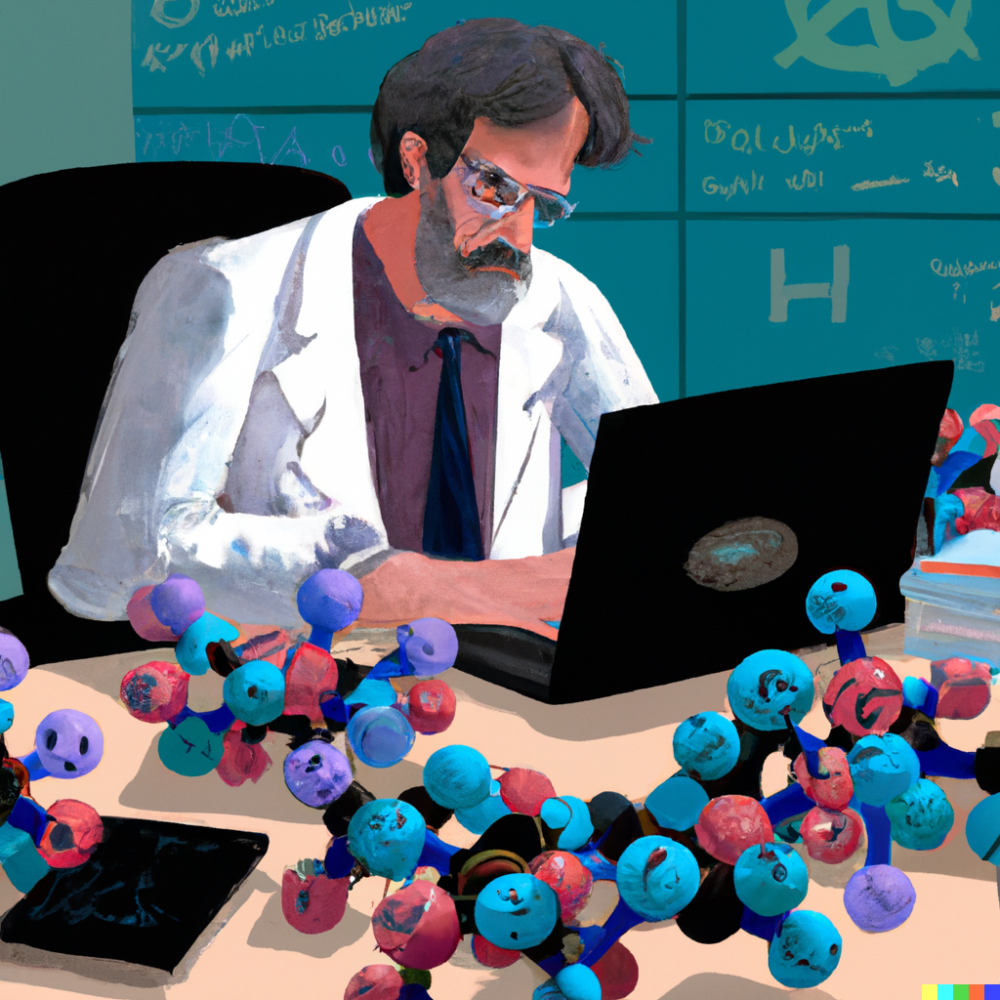

GPT3 for molecular and materials design and discovery
================

<!-- WARNING: THIS FILE WAS AUTOGENERATED! DO NOT EDIT! -->
<!-- DALL·E 2022-08-31 09.08.40 - scientist at a laptop using large language models such as GPT-3 for discovering novel molecules that save the world, digital art.png -->

## Install

    pip install gpt3forchem

## How to use

- the `legacy` directory contains code from initial exploration. The
  relevant parts have been migrated into notebooks.

- the `experiments` directory contain code for the actual fine-tuning
  experiments

Before you can use it, you need to set up the OpenAI API access (you
might need to export your `OPENAI_API_KEY`)

Also, you need to keep in mind that there are [rate
limits](https://help.openai.com/en/articles/5955598-is-api-usage-subject-to-any-rate-limits)
wherefore we needed to add some delays between requests (and typically
also not evaluate on the full datasets).
